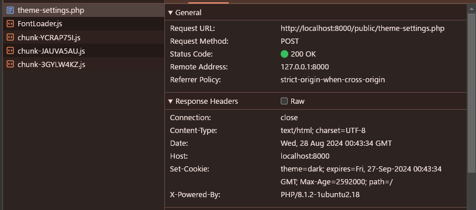

# 週報　 2024/08/26 ~ 2024/09/01

### 今週やったこと：実際にやったこと・実稼働

- バックエンドプロジェクト5（25時間ほど）

### タスクの進捗について

- バックエンドプロジェクト5 
  - 69%完了
### 学び
---
## データアクセス層
### ORM

- ORM は、OOP オブジェクトをリレーショナルデータベースのテーブル行にマッピングすることで、データアクセス層を抽象する
- fakerインストールコマンド

```bash
composer require fakerphp/faker
```
### クッキーとセッション

- クライアント上に直接データを保存することも可能⇒HTTPクッキー
    - クライアントが保存しているデータを含む HTTP ヘッダーを介して渡す
    - クッキーデータをサーバに送信
    - サーバがクライアントにクッキーを保存させ、クッキーを将来の HTTP リクエストで送信できるようにする場合、サーバは set-cookie ヘッダーで応答する
    - クライアントはそのクッキーデータを端末に保存する
    - それ以降、クライアントは HTTP リクエストにクッキーヘッダー下でこれらのクッキーを常に添付する
- サンプルコードでのクッキーデータの例（一度POSTした後例フレッシュしても、クッキーデータがヘッダーに存在し続ける）


### ローカルストレージ（クライアントストレージ）

- サーバがクライアントに保存されたデータを知る必要がない場合は、クライアントストレージを使用することも有効

### セッションデータ

- 使用例としては認証やキャッシング
- クライアントに一時的にデータを添付し、サーバに安全に保存し、サーバが簡単にアクセスできるようにする場合に使用する
- 定の時間にクライアントを一意に識別し、サーバ側にクライアントに関するデータを添付する
    - 認証やキャッシングなど
- クライアント側に保存されるのはセッション ID のクッキーのみであり、以前のデータはバックエンドに保存される
- phpの場合、 /var/lib/php/sessions/session_idのファイルにデータが保存されている

---

## ユーザー認証とミドルウェア

- バックエンドはセッションデータを使用してユーザーを認識する
    - 状態を持つ認証⇒セッションデータにログイン情報が持っている
    - セッション認証

### 来週のタスク

- バックエンド開発 5(Server With Database)　25h
  - ユーザー認証とミドルウェア