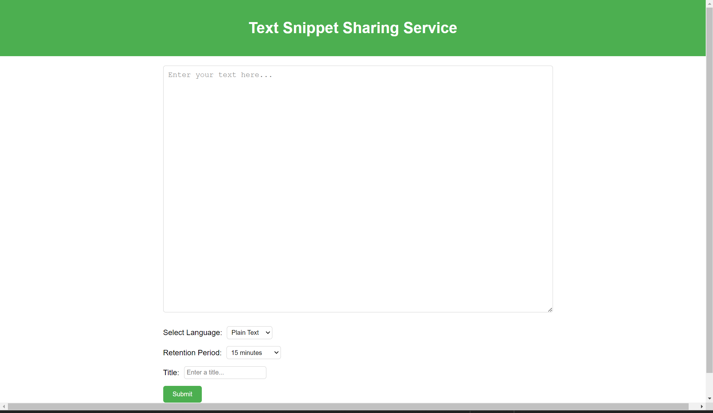

# 週報　 2024/07/23 ~ 2024/07/29

### 今週やったこと：実際にやったこと・実稼働

- バックエンドプロジェクト5（25時間ほど）

### タスクの進捗について

- バックエンドプロジェクト5 
  - 39%完了
- Text Snippet Sharing Service入力画面実装

- DBテーブル作成

### 学び
**クライアントサーバでのレンダリング(6)**

- RouterにAPIパスを追加
- 文字列のvalidation helperを作成
- Database Helpeにロジックを書く

### **Text Snippet Sharing Service**

- 下記コードで、スキーマ管理のためのsqlを出力する⇒ロジックは自身で書く

```bash
php console code-gen migration --name CreateUserTable1
```

- migrationテーブルを更新する
```bash
php console migrate --init
 php console migrate --rollback　// ロールバックする場合
```
### 来週のタスク

- バックエンド開発 5(Server With Database)　25h
  - Text Snippet Sharing Serviceの実装完了