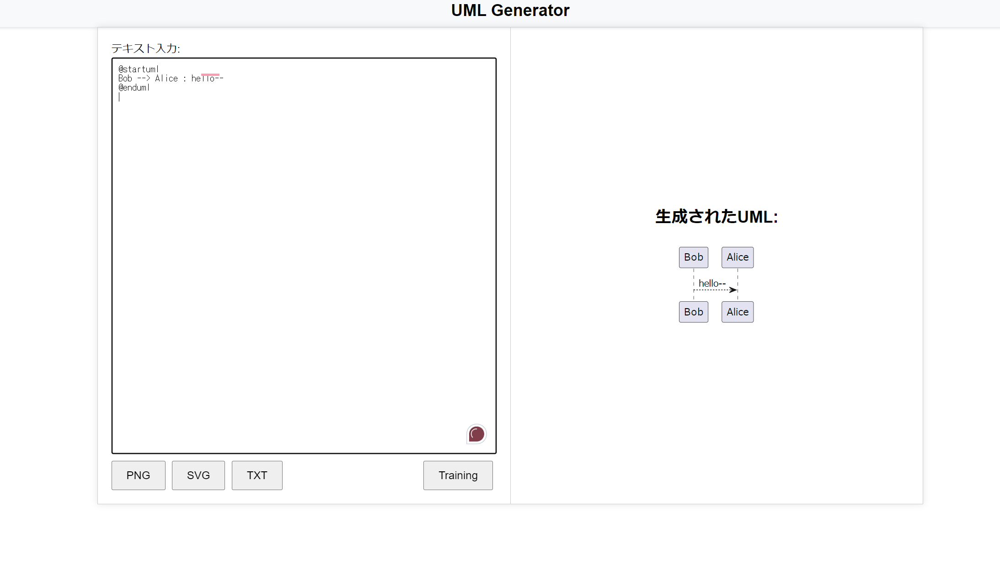
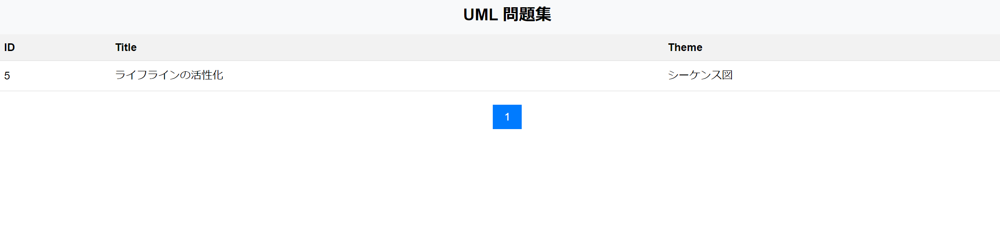
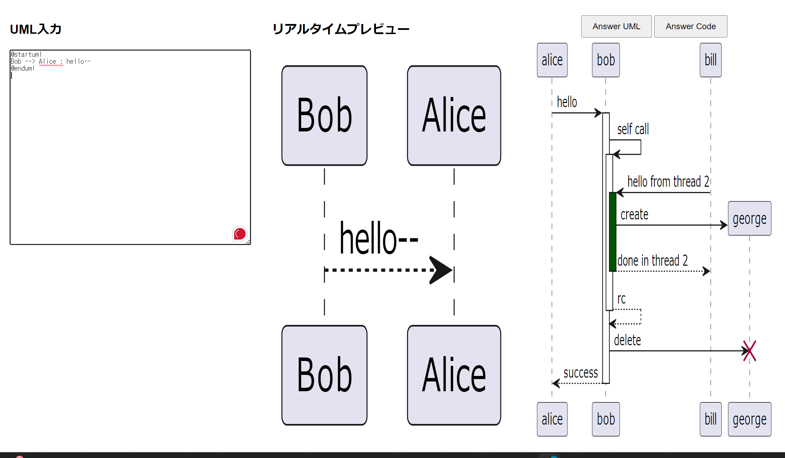

# 週報　 2024/06/20 ~ 2024/06/27

### 今週やったこと：実際にやったこと・実稼働

- バックエンドプロジェクト4（20時間ほど）

### タスクの進捗について

- バックエンドプロジェクト4
    - PlantUML Serverの実装

### 詳細

  - リアルタイムにPlant UML APIにリクエストし画面にsvgを表示する
  - txt, svg, pngボタンで別画面に該当のフォーマットが表示され、ダウンロードできる

---
 
- jsonファイルから、練習問題を読み込む

---

- テキストインプット、入力した値に該当するUML図の表示、回答のUML図のsvgの表示

### 来週のタスク

- Plan UML Server(20h)
  - 練習画面のリアルタイムプレビュー、回答のsvgの幅調節
  - 解答UMLのコードの表示